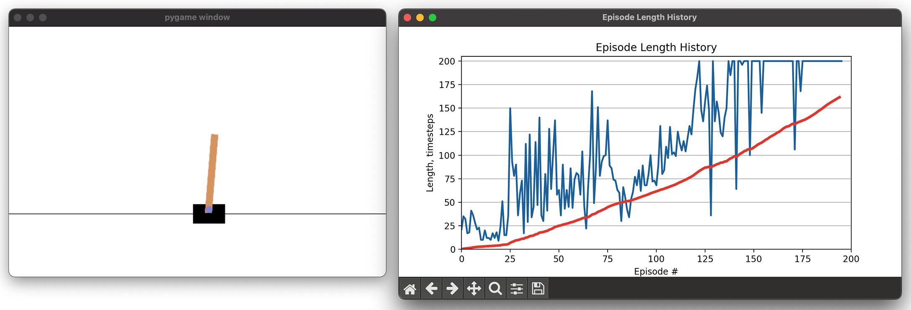

# cartpole-q-learning

A cart pole balancing agent powered by Q-Learning ([OpenAI submission](https://gym.openai.com/evaluations/eval_K41KvF0Re6BJW593cq2Tg)). Uses Python 3 and [OpenAI Gym](https://gym.openai.com/).

## Prerequisites

### Linux (Ubuntu-based)

    $ apt install ffmpeg libav-tools
    $ pip3 install -r requirements.txt

### macOS (with Homebrew)

    $ brew install ffmpeg libav
    $ pip3 install -r requirements.txt

### Windows (with Chocolatey)

    > choco install ffmpeg
    > pip install -r requirements.txt
