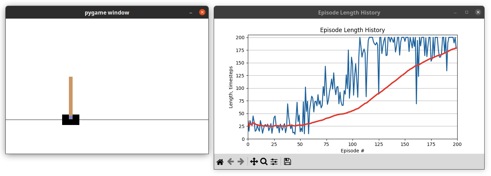

# cartpole-q-learning

A cart pole balancing agent powered by Q-Learning. Uses Python 3 and [Gymnasium](https://gymnasium.farama.org/) (formerly [OpenAI Gym](https://github.com/openai/gym)).




## Prerequisites

This project uses [Poetry](https://python-poetry.org/) for managing Python packages and tools. Please [install it](https://python-poetry.org/docs/#installation) first.

Then install the dependencies using:
```shell
$ poetry install --without dev --no-root
```

## Running

To run the environment in verbose mode (with rendering, plotting, and detailed logging), run:

```shell
$ poetry shell
$ python run.py --verbose
```

To run in performance mode (no visualizations, only basic logging), run:

```shell
$ poetry shell
$ python run.py
```

Episode statistics will be available in `experiment-results/episode_history.csv`.

## Troubleshooting

#### Issue: Episode History window not showing up on Linux

You may need to install the `TkAgg` backend support for matplotlib in order for the GUI window to show up properly. For example:

```shell
$ sudo apt install python3.10-tk
```


## Development

Install the development dependencies:

```shell
$ poetry install --with dev --no-root
```

Install pre-commit hooks (recommended):

```shell
$ pre-commit install
```

Run unit tests:

```shell
$ pytest .
```
